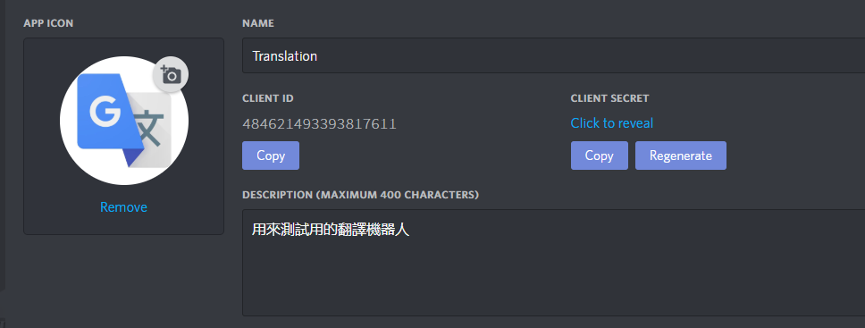
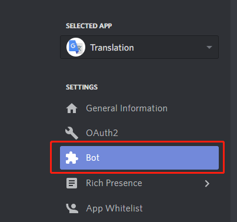
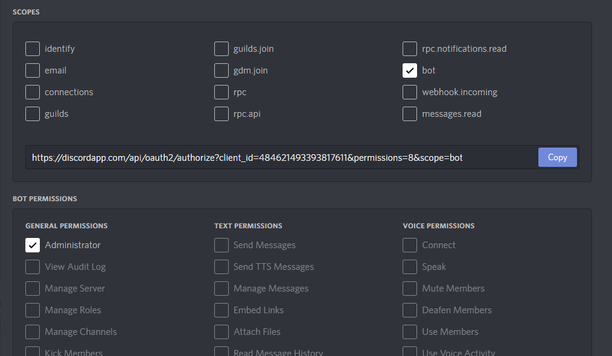
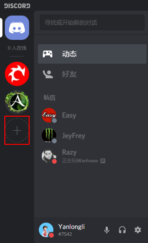
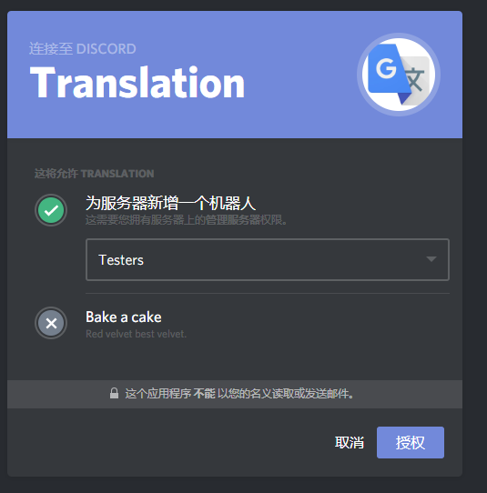

## 步骤：
    
###【如果你认为做了某一步骤请看下一步】
        
1. 账号
    1. 注册
        1. 访问网址 https://discordapp.com/register
        2. 无图，注册都不会请出门左转
    2. 登陆
        1. 访问网址 https://discordapp.com/login
        2. 无图，登陆都不会请出门右转
2. 创建APP
    1. 你需要在Discord创建一个APP后才能继续
    2. 访问：https://discordapp.com/developers/applications/
    3. 打开后...卧槽，又全<s><font color=red>TM</font></s>是英文
    4. 没事，跟着我看下图
    5. 看见这图没
    6. NAME => 名字 作为开发者你不会不知道
    7. DESCRIPTION =》描述 还用我再DESCRIPTION？
    8. 如果你修改了，会提示你要保存。点击 <table><tr><td bgcolor=#7289da color=#ffffff onclick='alert("我的天哪，世上怎会有如此厚颜无耻之人！")'><font color=#ffffff>**Save Changes**</font></td></tr></table>
3. 在APP中创建一个机器人（或许不需要，you know）
    1. 点击左侧中的 Bot （找不到？那你去打电话问官方客服，如果Ta鸟你）
    2. 
    3. 然后<table><tr><td bgcolor=#7289da color=#ffffff onclick='alert("不是让你点我，是去点网页！懂？")'><font color=#ffffff>Add Bot</font></td></tr></table>
4. 授权 OAuth2
    1. 点开 OAuth2
    2. 跟着我点击SCOPES中的Bot 和 BOT PERMISSIONS中的Administrator
    3. 这是做什么用的？```我就不告诉你是以管理员方式授权```
    2. 
    3. 看到中间的链接没？先放那
5. 创建一个服务器
    1. 上面用来干嘛的？
    2. 当然是用来给服务器```又称公会```提供服务的
    3. 如图
    4. 再详细你自己去弄吧
6. 此时在浏览器中打开我们第4步创建的 
    1. 我的是 https://discordapp.com/api/oauth2/authorize?client_id=484621493393817611&permissions=8&scope=bot
    2. 
    3. 该做什么不该做什么你心里没点B数？